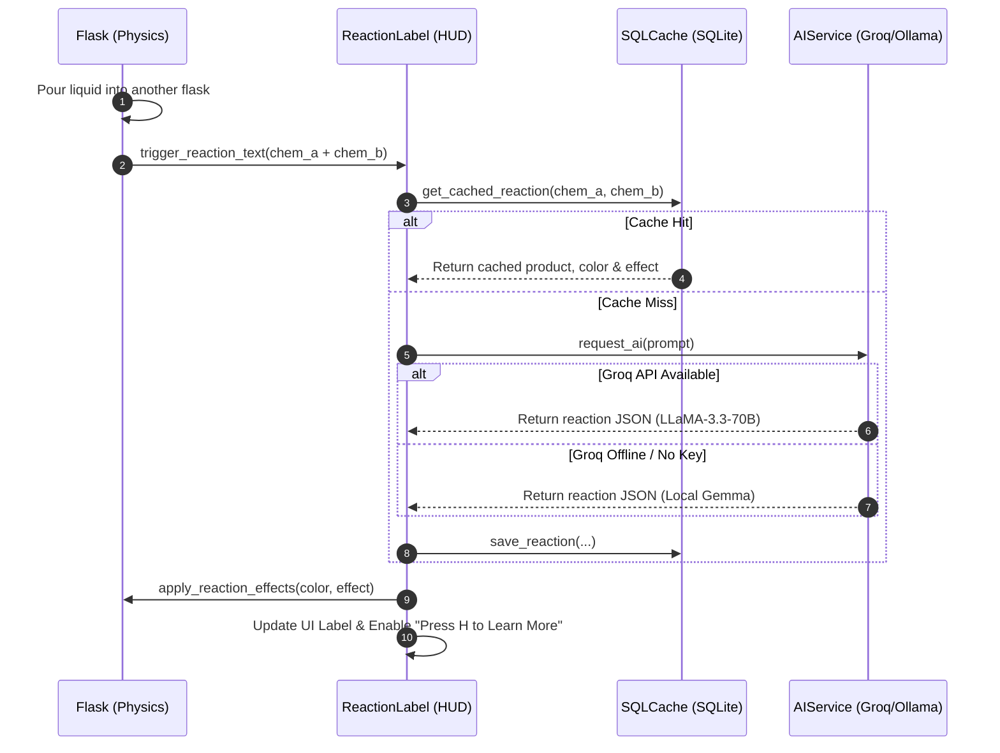

# System Architecture - The Science Lab

## Overview
**The Science Lab** is an interactive 3D chemistry simulation and educational sandbox built in **Godot 4**. It combines real-time 3D rigid-body container physics, custom fluid GDShader rendering, local SQLite caching, and a multi-tiered LLM system (Groq API + local Gemma fallback) to dynamically analyze, color, and explain chemical reactions.

---

## High-Level System Architecture

```
+-----------------------------------------------------------------------------------+
|                                 USER INTERFACE                                    |
|   +--------------------------+  +-------------------+  +----------------------+   |
|   | LabInventory (GLoot UI)  |  | ReactionLabel HUD |  | Detail Explanation   |   |
|   +--------------------------+  +-------------------+  +----------------------+   |
+----------------------------------------|------------------------------------------+
                                         |
                                         v
+-----------------------------------------------------------------------------------+
|                             SIMULATION & GAMEPLAY                                 |
|   +--------------------------+  +-------------------+  +----------------------+   |
|   | Flask (RigidBody3D)      |  | RayCast Pouring   |  | Liquid Wobble Shader |   |
|   +--------------------------+  +-------------------+  +----------------------+   |
+----------------------------------------|------------------------------------------+
                                         |
                                         v
+-----------------------------------------------------------------------------------+
|                                CORE SINGLETONS                                    |
|   +---------------------------------------------------------------------------+   |
|   | SQLCache (Local SQLite Database: user://chemistry_cache.db)               |   |
|   +---------------------------------------------------------------------------+   |
|                                        | (Miss)                                   |
|                                        v                                          |
|   +---------------------------------------------------------------------------+   |
|   | AIService (Multi-Tier LLM Gateway)                                        |   |
|   |   1. Groq API (llama-3.3-70b-versatile)                                   |   |
|   |   2. Ollama Local Fallback (gemma4:4b / gemma3:4b)                        |   |
|   +---------------------------------------------------------------------------+   |
+-----------------------------------------------------------------------------------+
```

---

## Key Subsystems & Components

### 1. Core Services & Autoloads (`project.godot`)

| Autoload Singleton | Script Location | Primary Responsibility |
| :--- | :--- | :--- |
| **`AIService`** | [AIService.gd](file:///c:/Projects/the-science-lab/scripts/core/AIService.gd) | Manages asynchronous LLM API communication. Reads `.env` for `GROQ_API_KEY`, sends HTTP POST requests to Groq Cloud API, and automatically falls back to local Ollama (`http://127.0.0.1:11434`) if offline or missing key. |
| **`SQLCache`** | [SQLCache.gd](file:///c:/Projects/the-science-lab/scripts/core/SQLCache.gd) | Handles SQLite database persistence (`user://chemistry_cache.db`). Stores cached reaction outputs, chemical visual colors, and generated compound definitions. |
| **`SimpleGrass`** | `addons/simplegrasstextured/` | Manages 3D grass mesh instancing and global foliage shader properties (`sgt_wind_direction`, `sgt_player_position`). |

---

### 2. Simulation & Liquid Mechanics

- **Container Physics & Tipping (`scripts/flasks/flask.gd`, `parent_flask.gd`)**:
  - Flasks are `RigidBody3D` nodes tracking orientation relative to global `Vector3.UP`.
  - When tilt exceeds `tilt_threshold` (85°), `GPUParticles3D` pouring particles activate, and `current_liquid_height` drains at `DRAIN_SPEED`.
- **Raycast Volume Transfer**:
  - A child `RayCast3D` detects receiving containers below the stream.
  - Calling `fill_liquid(amount, chemical_name)` transfers volume and triggers chemical reaction evaluations if reactant formulas differ.
- **Liquid Shader Mechanics (`shaders/liquid_shader.gdshader`, `shaders/liquid_alt.gdshader`)**:
  - 3D custom shader calculating liquid level planes, surface tint (`Liquid Surface Color`), wobble displacement, and interior volume opacity.
- **Liquid Wobble Physics (`scripts/liquids/LiquidWobble.gd`)**:
  - Computes container acceleration and angular velocity, passing dynamic sine wave offset uniforms to the fluid shader material.

---

### 3. User Interface & Dynamic Inventory

- **`LabInventory` (`scripts/ui/LabInventory.gd`)**:
  - Powered by the **GLoot** inventory plugin (`addons/gloot/`).
  - Features custom vector icon rendering via `LabItemIcon` (`_draw()` primitives for flasks, beakers, goggles, manuals, and test tubes).
  - Supports quick-slot hotbars and equipping 3D flasks into hand anchor nodes.
- **Dynamic AI Chemical Synthesis**:
  - Searching for an unlisted chemical in the inventory triggers a database lookup via `SQLCache`.
  - On a cache miss, `AIService` generates the compound's chemical formula, description, visual accent color, and category, dynamically adding it to the GLoot inventory and caching it in SQLite for future sessions.
- **Educational Reaction HUD (`scripts/core/ReactionLabel.gd`)**:
  - Member of the global `ReactionHUD` group.
  - Displays chemical reaction equation notices (e.g. `HCl + NaOH -> NaCl + H2O`).
  - Pressing **`H`** opens `DetailPanel`, displaying concise scientific explanations generated by AI or loaded instantly from cache.

---

## Data Flow & Processing Pipelines

### Reaction Evaluation & Caching Pipeline



---

## Repository Directory Structure

```
the-science-lab/
├── .agents/                    # Custom agent instructions & Groq-Godot skill
├── addons/                     # Third-party plugins (GLoot, SimpleGrassTextured)
├── data/                       # Prototype & asset definition files
├── docs/                       # Architecture & developer documentation
│   ├── ANTIGRAVITY.md          # Agent guidelines & Groq setup
│   └── ARCHITECTURE.md         # Full system architecture documentation
├── scenes/
│   ├── flasks/                 # 3D Flask prefabs (flask.tscn, flask2.tscn)
│   ├── liquids/                # Fluid demo scenes & liquid meshes
│   └── main/                   # Primary 3D lab environment (node_3d.tscn)
├── scripts/
│   ├── core/                   # Autoloads & Core logic (AIService, SQLCache, ReactionLabel)
│   ├── flasks/                 # Physics, tipping & pouring behavior (flask.gd)
│   ├── liquids/                # Liquid wobble & height controllers
│   └── ui/                     # GLoot UI, procedural SVG icons, LabInventory
├── shaders/                    # Custom 3D fluid GDShader programs
└── project.godot               # Godot 4 project file & Autoload registry
```

---

## Environment & Development Setup

### Configuration (`.env`)
Place a `.env` file in the project root:
```ini
GROQ_API_KEY=gsk_your_groq_api_key_here
OLLAMA_URL=http://127.0.0.1:11434/api/generate
GEMMA_MODEL=gemma4:4b
```

### Verification Command
To verify GDScript syntax and engine integrity headlessly:
```powershell
& "C:\Users\sahil\OneDrive\Desktop\Godot_v4.7.1.exe" --path . --headless --check-only
```
